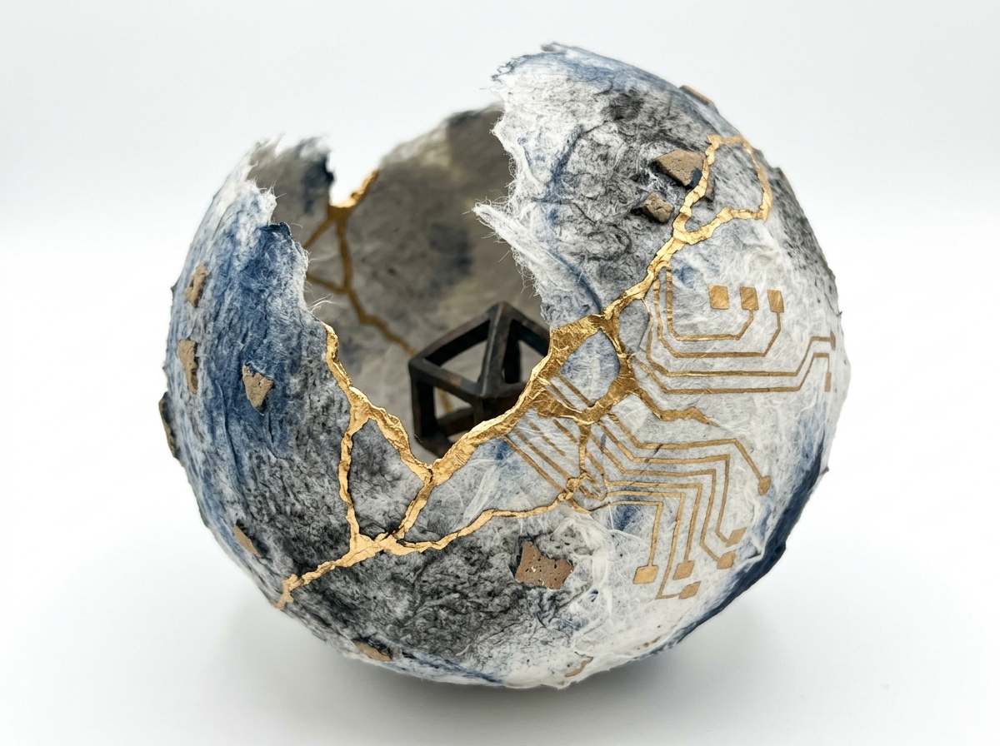
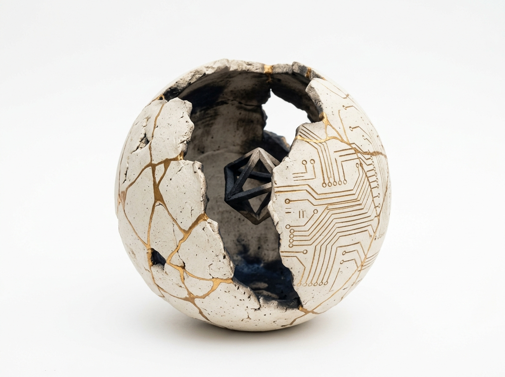
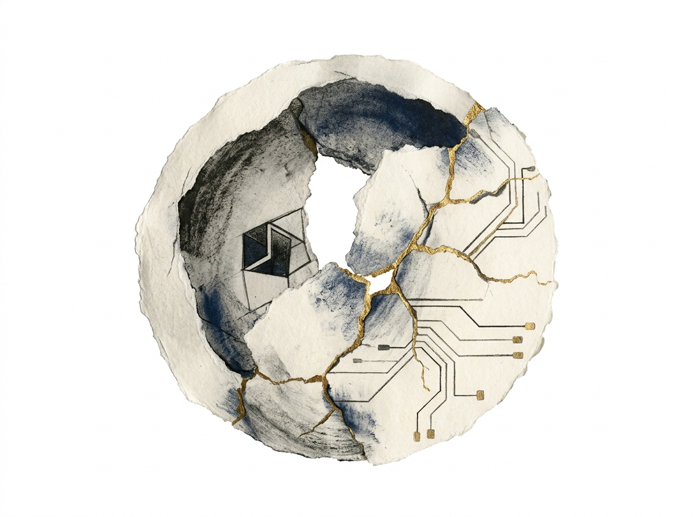
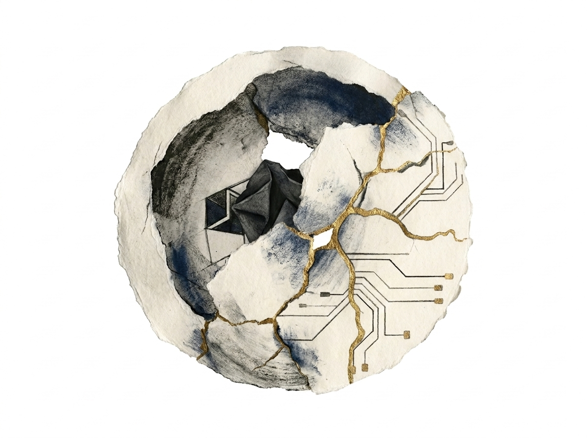
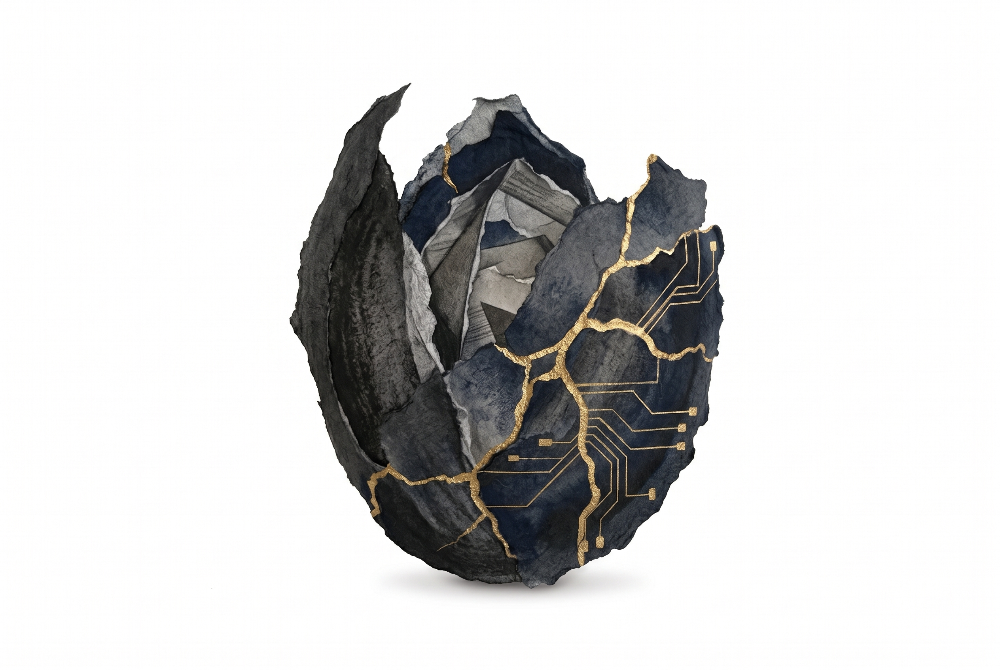
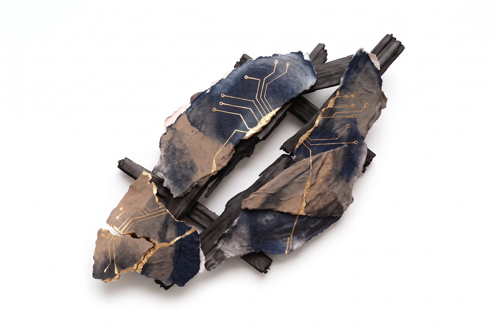
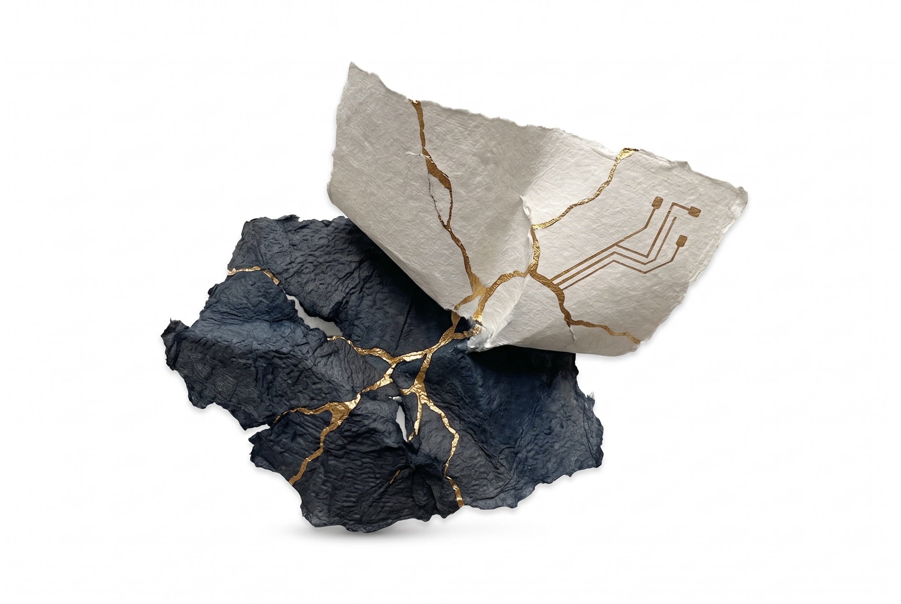

# Sacred Struggle image language

Status: approved and in use for the cover and three part plates.

## Decision

Use isolated, tactile forms on white. Each image begins with an imperfect organic material. A gold repair joins its fractures and gradually changes into precise circuit traces.

The working name for this rule is **fracture to circuit**. It describes an action, not a fixed symbol: damage becomes structure, and structure becomes technology. The gold must always do physical or visual work. It must never appear as loose decoration.

The preferred medium is mineral pigment, charcoal, fibrous paper, and metallic gold leaf. It has the softness and visible material texture of watercolor without the familiar storybook-watercolor look. The circuit lines remain crisp enough to contrast with the torn edges and pigment blooms.

## What the images need to do

- Give the reader a short visual pause at a major transition.
- Hold human brokenness and machine precision in the same object.
- Feel made from physical matter, even when the image is generated.
- Suggest one chapter idea without explaining or summarizing the chapter.
- Remain legible in a six-by-nine-inch PDF and in reflowable EPUB readers.
- Form one family when the images are viewed together.

## Fixed visual rules

### Ground and composition

- Use a pure or near-white background with no frame, scene, horizon, room, or page edge.
- Float one main form near the optical center. Keep at least 25 percent of the canvas empty on every side.
- Use an irregular silhouette and an asymmetric balance. Avoid centered emblems, logos, mandalas, and icons.
- Allow a faint contact shadow only when the object would otherwise lose its shape. Do not use a dramatic cast shadow.
- Keep the entire form visible. A deliberate close crop is reserved for the cover.

### Materials

- Build the organic side from two or three tactile materials: fibrous paper, fired clay, mineral pigment, charcoal, stone, wood, thread, root, shell, or oxidized metal.
- Show small defects such as torn fibers, chips, rubbed pigment, uneven glaze, or hairline cracks.
- Render the machine side as a change in structure, not a separate gadget attached to the object.
- Avoid glossy 3D plastic, chrome, neon, holograms, lens flares, and generic science-fiction interfaces.

### Gold

- Use warm, imperfect metallic gold close to the book color `#c9a574`, with brighter highlights and darker `#94744a` edges where needed.
- Begin with branching kintsugi seams that follow real fractures.
- Let some seams become circuit paths: straighter runs, right-angle turns, small pads, and occasional nodes.
- Preserve a visible transition zone where an organic crack becomes designed geometry.
- Keep gold below roughly 12 percent of the object area. It is a repair and a conductor, not a coating.

### Color

- Start with warm white, bone, charcoal, and the book's deep navy `#1c2540`.
- Add one muted material color when a chapter needs distinction: rust, moss, clay red, smoke blue, or bruised violet.
- Use low saturation. Gold is the only bright color.
- Do not tint the white background. The image must disappear cleanly into the printed page.

### Detail and finish

- Combine soft, irregular texture with a few exact lines. The contrast between them carries the human-machine theme.
- Retain visible grain and fibers at print resolution.
- Do not include text, letters, numbers, signatures, watermarks, UI, faces, hands, robots, brains, light bulbs, or literal computer hardware.
- Avoid perfect bilateral symmetry and overly complete objects. The repair should not erase the break.

## Image hierarchy

### Cover

The cover moves the same materials onto a dark field. It uses a close-cropped smoke-blue current whose imperfect gold boundary becomes connected circuit traces. Keep the current only faintly suggestive of an ocean or coastline. The detailed production rules and reusable prompts are in [the cover specification](cover.md).

### Part plates

Part plates may use two or three connected forms and a denser field of gold. They should occupy about half of a part-opening page. Each one establishes the emotional territory of the part.

- **Part 1, The Machine Mind:** a rough, dark organic shell whose inner fracture network resolves into precise computational paths.
- **Part 2, Domains:** several unlike fragments held in one unstable system by shared gold connections. The fragments imply learning, work, intimacy, creativity, and choice without assigning one icon to each.
- **Part 3, The Ascent:** a form under tension that rises or opens because of its repaired breaks. The direction is upward, but it must not become a motivational mountain poster.

### Chapter vignettes

Chapter images use one form, fewer seams, and more empty space. Each starts from one metaphor, material action, or tension in the chapter. Repeated motifs are allowed when their state changes. For example, a thread may be slack in one chapter, bound in another, and conductive in a third.

Do not give every subsection an image. Repetition at that frequency would reduce the images to decoration.

## Placement

- Place a part plate between the part label and title, or directly below the title when the plate needs more width.
- Place a chapter vignette below the chapter title and above the opening paragraph.
- Use the same source image in PDF, EPUB, and the reading site.
- Keep part plates at a 3:2 aspect ratio. Keep chapter vignettes at 4:3 so narrow EPUB screens can scale them without excessive height.
- Give every image short alt text that names the visible form and its material. Do not explain the chapter metaphor in the alt text.

## Medium studies

The first studies use the same abstract broken form so only the material treatment changes.

1. **Mineral pigment and fiber.** Handmade paper, dry mineral wash, charcoal, torn fibers, and metallic leaf. This has strong material presence, broad metaphorical range, and a clear contrast between soft matter and exact circuitry.

   

2. **Ceramic sculpture.** Matte bone ceramic with kintsugi lacquer and etched circuit paths, photographed on white. This makes the repair legible at once, but repeated ceramic objects may become literal and product-like.

   

3. **Torn-paper monotype.** Layered paper, ink transfer, graphite, and gold foil. This is expressive and easy to vary, but it may carry less weight than the first two treatments at full-page size.

   

The selected treatment is the torn-paper monotype, strengthened with some of the fiber relief and imperfect gold from the first study. It integrates with the white page instead of reading as a photographed object. It also leaves more room to vary the form across chapters without making every image another piece of repaired pottery.

The hybrid study applies that recommendation:

This is the base treatment. The final subjects use less geometric interiors and do not repeat the study's hidden machine core.

## Final part plates

The three plates use a progression of closed, divided, and opening forms. Their shared materials and gold behavior make them one family, while their silhouettes prevent the repeated-emblem effect.

### Part 1: The Machine Mind

A dark seed husk opens onto an ambiguous layered interior. The outer form remains rough and partly closed while repaired fractures become exact paths across the inner layers.

### Part 2: Domains

Unlike paper, clay, and wood fragments pull apart around an open void. Shared gold repairs hold the system together, and selected repairs become conductive paths without closing the gap.

### Part 3: The Ascent

A compressed dark fold supports a lighter torn plane that opens upward. Its repaired fractures carry the tension, so the ascent remains incomplete and physical.

## Prompt grammar

Use this structure for every final image:

> Editorial image for *Sacred Struggle*. [One physical form and action]. Made from [two or three organic materials]. Real fractures are repaired with imperfect warm metallic gold; the repair gradually changes into precise circuit traces with restrained right-angle paths and small contact pads. [One muted accent color]. Isolated on pure white with generous empty space, no border, no scene, no text. Tactile, restrained, asymmetric, contemplative. Avoid [literal or generic symbols relevant to this subject].

Keep the fixed language stable. Change only the physical form, action, materials, and optional accent color. This gives the image model enough repetition to produce a family.

## Production checks

An image can enter the book only when all of these are true:

- The background reaches clean white at every edge.
- The image has no accidental border, text, watermark, or cut-off form.
- The gold visibly repairs at least one fracture and visibly becomes circuitry somewhere else.
- Organic texture remains visible at the final print size.
- The object reads at thumbnail size without becoming a logo.
- Its dominant silhouette differs from adjacent images.
- A PDF proof and an EPUB proof both preserve detail and placement.

## Next image set

The next set is a small group of chapter vignettes. Select chapters only where one material action or metaphor adds a useful pause. Keep the part plates as the largest images in the book.
